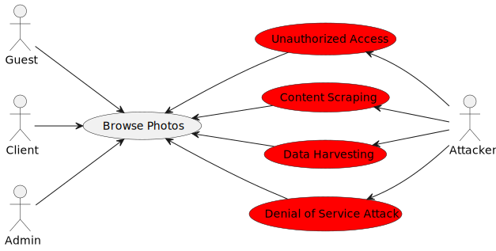

# Abuse Cases and Test Planning

## Abuse Cases

### Abuse cases for Sign Up and Login

### Abuse cases for Browse Photos

Here we have the list of abuse cases with a description associated and a mitigation for each one.

| Abuse Case                  | Description                                                                   | Priority | Risk                                                                              | Mitigation                                                                                                                                                                         |
|-----------------------------|-------------------------------------------------------------------------------|----------|-----------------------------------------------------------------------------------|------------------------------------------------------------------------------------------------------------------------------------------------------------------------------------|
| Brute Force Attack          | The attacker keeps trying to break into user accounts without permission      | High     | High: Potential data breaches and unauthorized access                             | Implement measures like account lockouts, strong password policies, and monitoring for strange login behavior.                                                                     |
| Automated Registration      | The attacker uses automated tools to create many fake accounts, which can overwhelm the system and drain resources. | High     | High: Drain the system                                                            | CAPTCHA, rate limiting, and account verification to detect and stop automated registrations.                                                                                       |
| Credential Theft            | The attacker obtains login credentials through phishing or malware, resulting in unauthorized access.  | High     | High: Unauthorized access to user accounts and potential data breaches            | Implement 2-Factor authentication, ensure better credentials, regularly update security software.                                                                                   |
| Session Hijacking           | The attacker intercepts or steals session IDs to gain unauthorized access      | High     | High: Hijacking active user sessions and accessing sensitive data                 | Implementation of HTTPS, use secure cookies, and regularly rotate session IDs.                                                                                                      |
| Account Takeover            | The attacker gains unauthorized access to user accounts, compromising user account integrity and privacy.   | High     | High: Compromising user account integrity and privacy                             | Essential to implement strong authentication mechanisms, monitor for unusual account activity, and provide users with security awareness training.                                 |
| Unauthorized Access         | The attacker exploits vulnerabilities to gain access to restricted information | High     | High: Violating user privacy and confidentiality                                  | Implement access controls, encryption, and security patches to mitigate vulnerabilities and protect against unauthorized access.                                                   |
| Content Scraping            | The attacker uses automated tools to copy or download content without authorization | Medium | High: Undermining intellectual property rights and compromising content integrity | Implement rate limiting, CAPTCHA, and access controls to prevent unauthorized access to content and deter scraping.                                                                |
| Data Harvesting             | The attacker collects metadata or information associated with user accounts or system resources for malicious purposes | Medium | High: Threatening user privacy and confidentiality                                | Implement data encryption, anonymization techniques, and user consent mechanisms to protect against unauthorized data harvesting.                                                  |
| Denial of Service Attack    | The attacker floods the system with a high volume of requests, overwhelming resources and causing service downtime | High     | High: Disrupting normal system operations and causing loss of user trust          | Implement DDoS protection measures, such as rate limiting, traffic filtering, and distributed caching, and maintain scalable infrastructure to mitigate the impact of DoS attacks. |

## Test Planning

### Add Photo to cart and Create a Portfolio UC

##### 1. Unit Tests:
- **Add Photo to Cart UC**:
    - **Test Cases**:
        1. Verify that the correct item is added to the cart;
        2. Ensure that the quantity of the item in the cart is updated correctly;
        3. Test the calculation of the total price after adding items to the cart;
    - **Tools/Techniques**: Mocking frameworks for isolating components, assertion libraries for verifying outputs.

- **Create Portfolio UC**:
    - **Test Cases**:
        1. Validate that a portfolio is successfully created with valid input data;
        2. Ensure that the portfolio creation process handles error cases (e.g., empty input fields, maximum character limits);
        3. Test the behavior of the system when creating a portfolio with duplicate names or conflicting data;
    - **Tools/Techniques**: Mocking frameworks for isolating components, assertion libraries for verifying outputs.

##### 2. Functional Tests:
- **Add Photo to Cart UC**:
    - **Test Cases**:
        1. Validate that users can add items to the cart from different product pages;
        2. Test the behavior of the system when adding items to the cart with different quantities;
        3. Verify that users cannot add out-of-stock items to the cart;
    - **Tools/Techniques**: Test automation frameworks (e.g., Cypress).

- **Create Portfolio UC**:
    - **Test Cases**:
        1. Validate that photographers can successfully create a portfolio from the dashboard;
        2. Test the behavior of the system when creating portfolios with different types of media (e.g., images, videos);
        3. Verify that portfolios are displayed correctly on the photographer's profile page after creation;
    - **Tools/Techniques**: Test automation frameworks (e.g., Cypress).

##### 3. End-to-End (E2E) Tests:
- **Add Photo to Cart UC**:
    - **Test Cases**:
        1. Validate the end-to-end flow of adding items to the cart, including navigating product pages, adding items, and viewing the cart contents;
    - **Tools/Techniques**: Test automation frameworks (e.g., Cypress).

- **Create Portfolio UC**:
    - **Test Cases**:
        1. Validate the end-to-end flow of creating a portfolio, including logging into the photographer's account, navigating to the portfolio creation page, entering portfolio details, and saving the portfolio;
        2. Test the visibility of the new created portfolio on the photographer's profile page or portfolios page;
    - **Tools/Techniques**: Test automation frameworks (e.g., Cypress), headless browsers, browser automation tools.

