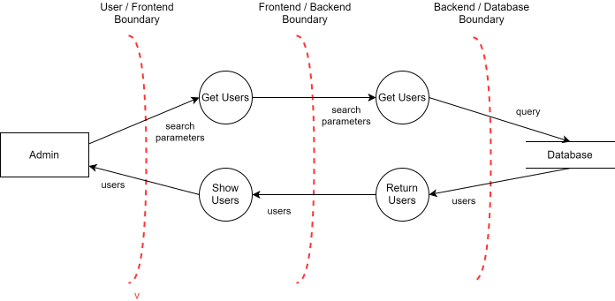
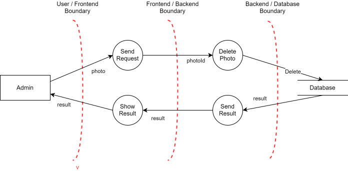
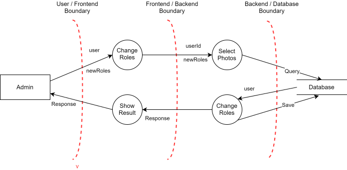
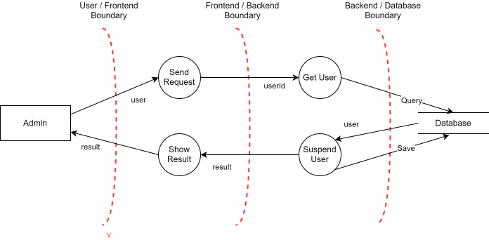
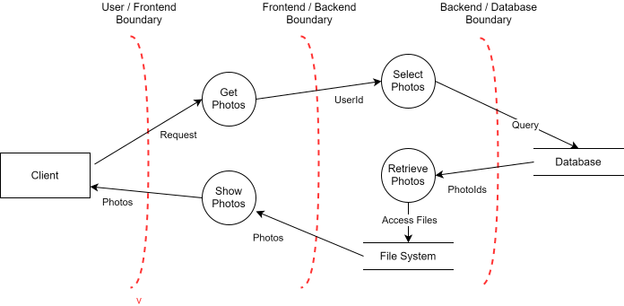
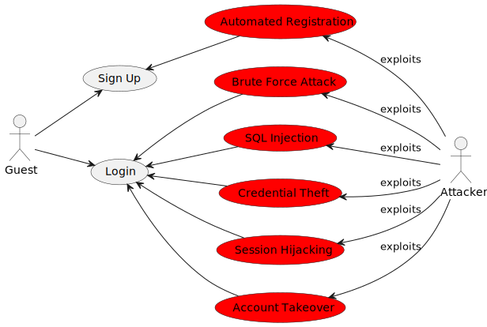
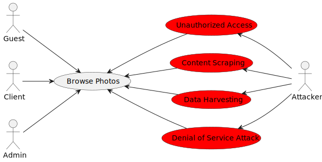
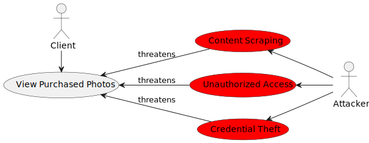
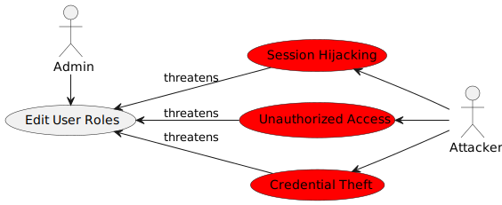

# Threat Modeling

## 1.Data Flow Diagram

In the Data flow Diagram we Divided the diagrams between the processes in order to clarify the flow of data of the processes in question.

### Login Register DFD

### Create Portfolio DFD

### Browse Photos DFD

### Add to Cart DFD

### Add a Photo up for sale DFD

### Browse Users DFD

### Checkout Cart DFD

### Delete Photo DFD

### Edit User Roles DFD

### Suspend User DFD

### Suspend User DFD

## 2 Security Requirements Engineering  
### 2.1 Authentication and Authorization  
#### Security Requirements:
- **User Authentication**: Put in place secure ways for clients, photographers, and admins to prove who they are (e.g., username/password combo, multiple verification steps) before accessing the website.

- **Role-based Access Control**: Define roles (client, photographer, admin) and assign features that are relevant to their role.

- **Session Management**: Use secure session management techniques to prevent session hijacking and ensure that user sessions expire after a defined period of inactivity.

- **Password Policy**: Implement a strong password policy that enforces minimum length, complexity(Checking against a set of breached passwords) for better user security.

### 2.2 Data Protection

#### Security Requirements:

- **Data Encryption**: Sensitive data (like user credentials, payment details) must be encrypted during transmission and when stored to prevent unauthorized access.

- **Secure Storage**: Develop appropriate storage for photos and user information.

- **Data Anonymization**: Anonymize user data where possible to protect the privacy of users.

### 2.3 Secure Transactions

#### Security Requirements:

- **Secure Payment Gateway**: Secure payment gateway, integrating strong encryption and fraud detection capabilities, is required to ensure secure financial transaction processing.

- **HTTPS Encryption**: Ensure that all HTTPS transactions occur including payment transactions so as to encrypt data in transit.

- **Transaction Logging**: For the sake of audit and monitoring, it is necessary to log all transaction activities intended for detecting suspicious or fraudulent transactions.

### 2.4 Content Protection

#### Security Requirements:

- **Watermarking**: Implement watermarked image techniques for photos thus discouraging unauthorized use or distribution without proper referencing.

- **Access Control**: Only authenticated users should be able to access high-resolution photos or premium content to avoid unapproved downloads or sharing.

- **Digital Rights Management (DRM)**: DRM technologies are implemented here to protect copyright and determine photo access, copying as well as distribution.

### 2.5 Secure Administration

#### Security Requirements:

- **Admin Access Controls**: The admin accounts should have stringent access controls in order to prevent any unauthorized entry into administrative functionalities such as sensitive data storage facility.

- **Audit Logging**: Log all admin activities and changes made to the website's configuration or user data for accountability and forensic purposes.

- **Two-Factor Authentication (2FA)**: Enforce 2FA for admin accounts to add an extra layer of security and prevent unauthorized access in case of compromised credentials.

### Files and Resources:

#### Security Requirements:
- **Input Validation**: Check file size and file count before uncompressing.
- **Limits**: Enforce maximum uncompressed size and file count to prevent resource exhaustion.
- **Error Handling**: Provide clear error messages for rejected files.

**Solution**: Make sure to validate files on the server before uncompressing them by checking their size and number to make sure they meet the specified limits.

### RESTful Web Service:

#### Security Requirements:
- **Verify that JSON schema validation is in place and verified before accepting input.**:Add JSON schema validation to the input processing pipeline of the application. Validate input data against the predefined JSON schema before processing to ensure it meets expected formats and integrity. Provide user feedback in case of any errors.

### Malicious Code Search:

#### Security Requirements:
- **Verify that the application source code and third party libraries do not contain unauthorized phone home or data collection capabilities. Where such functionality exists, obtain the user's permission for it to operate before collecting any data.**:Make sure to review the code of the application and any third-party libraries carefully to spot any hidden features that send data without permission.

### Sensitive Private Data:

#### Security Requirements:
- **Verify that users have a method to remove or export their data on demand.**:Add a feature to the app that allows users easily to delete or download their data when needed. Include straightforward instructions and user-friendly interfaces to make the process smooth and secure.

### Data Protection and Privacy Architecture:

#### Security Requirements:
- **Verify that all sensitive data is identified and classified into protection levels.**:Conduct a comprehensive data inventory to identify and classify all sensitive data handled by the application

### Access Control Architecture:

#### Security Requirements:
- **Verify the application uses a single and well-vetted access control mechanism for accessing protected data and resources**:Ensure that the app routes all requests from different sources so it doesn't allow unauthorized entry points into the data or systems.

### Implementation of Automated Security Checks in Build Pipeline:

#### Security Requirements:
1. **Verify that the build pipeline contains a build step to automatically build and verify the secure deployment of the application.**

**Solution**: Make sure to include automated security checks in the build pipeline to guarantee that the deployment process is secure and adheres to security standards.

### Implementation of Password Change Functionality:

#### Security Requirements:
1. **Verify users can change their password.**

**Solution**: Create a feature that enables users to change their passwords securely.

### Implementation of Attribute-Based Access Control with Immutable User and Data Attributes:

#### Security Requirements:
1. **Verify that all user and data attributes and policy information used by access controls cannot be manipulated by end users unless specifically authorized.**

**Solution**: Utilize Attribute-Based Access Control (ABAC) to uphold access control guidelines grounded on user and data attributes, incorporating immutable attributes to hinder alteration by users.

### Implementation of Multi-Factor Authentication for Administrative Interfaces:

#### Security Requirements:
1. **Verify administrative interfaces use appropriate multifactor authentication to prevent unauthorized use.**

**Solution**: Add multifactor authentication (MFA) to administrative interfaces for increased security and protection against unauthorized access.

### Implementation of Secure Data Transmission Practices:

#### Security Requirements:
1. **Verify that sensitive data is sent to the server in the HTTP message body or headers, and that query string parameters from any HTTP verb do not contain sensitive data.**

**Solution**: Ensure sensitive data is securely transmitted to the server by implementing secure data transmission practices, to avoid exposure in URLs or query string parameters.

### Implementation of Content-Type Validation for Uploaded Files:

#### Security Requirements:
1. **Verify that direct requests to uploaded files will never be executed as HTML/JavaScript content.**

**Solution**: Please add content-type validation for uploaded files to prevent them from being incorrectly executed as HTML or JavaScript content if accessed directly.

### Implementation of Role-Based Access Control for RESTful API Methods:

#### Security Requirements:
1. **Verify that enabled RESTful HTTP methods are a valid choice for the user or action, such as preventing normal users using DELETE or PUT on protected API or resources.**

**Solution**: Create role-based access control (RBAC) for RESTful API methods to limit access to HTTP methods according to user roles and permissions. This helps prevent unauthorized use of critical HTTP methods like DELETE or PUT.

## Abuse Cases

### Abuse cases for Sign Up and Login

### Abuse cases for Browse Photos

### Abuse Cases for View Purchased Photos

### Abuse Cases for Edit User Roles

Here we have the list of abuse cases with a description associated and a mitigation for each one.

| Abuse Case                  | Description                                                                   | Priority | Risk                                                                              | Mitigation                                                                                                                                                                         |
|-----------------------------|-------------------------------------------------------------------------------|----------|-----------------------------------------------------------------------------------|------------------------------------------------------------------------------------------------------------------------------------------------------------------------------------|
| Brute Force Attack          | The attacker keeps trying to break into user accounts without permission      | High     | High: Potential data breaches and unauthorized access                             | Implement measures like account lockouts, strong password policies, and monitoring for strange login behavior.                                                                     |
| Automated Registration      | The attacker uses automated tools to create many fake accounts, which can overwhelm the system and drain resources. | High     | High: Drain the system                                                            | CAPTCHA, rate limiting, and account verification to detect and stop automated registrations.                                                                                       |
| Credential Theft            | The attacker obtains login credentials through phishing or malware, resulting in unauthorized access.  | High     | High: Unauthorized access to user accounts and potential data breaches            | Implement 2-Factor authentication, ensure better credentials, regularly update security software.                                                                                   |
| Session Hijacking           | The attacker intercepts or steals session IDs to gain unauthorized access      | High     | High: Hijacking active user sessions and accessing sensitive data                 | Implementation of HTTPS, use secure cookies, and regularly rotate session IDs.                                                                                                      |
| Account Takeover            | The attacker gains unauthorized access to user accounts, compromising user account integrity and privacy.   | High     | High: Compromising user account integrity and privacy                             | Essential to implement strong authentication mechanisms, monitor for unusual account activity, and provide users with security awareness training.                                 |
| Unauthorized Access         | The attacker exploits vulnerabilities to gain access to restricted information | High     | High: Violating user privacy and confidentiality                                  | Implement access controls, encryption, and security patches to mitigate vulnerabilities and protect against unauthorized access.                                                   |
| Content Scraping            | The attacker uses automated tools to copy or download content without authorization | Medium | High: Undermining intellectual property rights and compromising content integrity | Implement rate limiting, CAPTCHA, and access controls to prevent unauthorized access to content and deter scraping.                                                                |
| Data Harvesting             | The attacker collects metadata or information associated with user accounts or system resources for malicious purposes | Medium | High: Threatening user privacy and confidentiality                                | Implement data encryption, anonymization techniques, and user consent mechanisms to protect against unauthorized data harvesting.                                                  |
| Denial of Service Attack    | The attacker floods the system with a high volume of requests, overwhelming resources and causing service downtime | High     | High: Disrupting normal system operations and causing loss of user trust          | Implement DDoS protection measures, such as rate limiting, traffic filtering, and distributed caching, and maintain scalable infrastructure to mitigate the impact of DoS attacks. |
| Unauthorized User Tries to Delete Photo        | An unauthorized user attempts to delete a photo without proper authentication or authorization.                     | High     | High: Potential data loss or corruption                        | Implement robust authentication and authorization mechanisms to ensure that only authorized users can perform deletion operations.       |
| Mass Deletion of Photos                        | A user attempts to delete a large number of photos at once, potentially causing system overload or data loss.        | High     | High: System overload, data loss                               | Implement rate limiting and confirmation dialogs to prevent accidental mass deletions and protect against intentional abuse.            |
| Delete Photo Belonging to Another User         | A user tries to delete a photo that belongs to another user, violating data ownership and privacy rights.           | High     | High: Data loss, privacy violation                              | Implement strict access controls and permissions to ensure that users can only delete their own photos.                                |
| Delete Non-existent Photo                      | A user attempts to delete a photo that does not exist, potentially causing system errors or data inconsistencies.  | Medium   | Medium: System errors, data inconsistencies                     | Implement error handling mechanisms to gracefully handle deletion requests for non-existent photos.                                    |
| Accidental Deletion                            | A user unintentionally deletes a photo due to interface confusion or misclicks.                                      | Medium   | Medium: Data loss, user frustration                             | Implement confirmation dialogs and undo functionalities to allow users to recover from accidental deletions.                            |
| System Overload by Searching All Users         | A user performs a search operation that retrieves a large number of user records, causing system overload.          | High     | High: System slowdown, resource exhaustion                      | Implement pagination and caching mechanisms to handle large datasets efficiently and prevent system overload.                         |
| Inadequate Filtering When Searching All Users | The search functionality lacks proper filtering, allowing users to retrieve sensitive information unintentionally. | High     | High: Data exposure, privacy violation                           | Implement robust filtering mechanisms and access controls to ensure that only authorized information is retrieved in searches.          |
| Display of Sensitive Information               | The system inadvertently displays sensitive user information, such as passwords or personal data.                  | High     | High: Data exposure, privacy violation                           | Implement data masking, encryption, and access controls to prevent unauthorized access to sensitive information.                      |
| Data Exploitation Through User Search         | An attacker exploits the search functionality to gather information about users for malicious purposes.            | High     | High: Data theft, privacy violation                              | Implement rate limiting, CAPTCHA, and access controls to detect and prevent automated data harvesting attempts.                        |
| Search for Specific User                      | A user searches for a specific user account to gather information without proper authorization.                   | Medium   | Medium: Privacy violation, unauthorized access                   | Implement access controls and logging mechanisms to track and audit user search activities, ensuring that only authorized users can access user information. |
| SQL Injection Attempt                          | An attacker attempts to inject SQL queries into the search functionality to gain unauthorized access to data.      | High     | High: Data theft, system compromise                              | Implement parameterized queries and input validation to prevent SQL injection attacks and protect against unauthorized access to sensitive data.    |
| Accessing Another User's Cart by ID           | A user attempts to access another user's shopping cart by manipulating the cart ID in the URL.                   | High     | High: Data theft, privacy violation                              | Implement proper authentication and authorization checks to ensure that users can only access their own shopping carts.                      |
| Non-existent Cart Selection                    | A user selects a shopping cart that does not exist in the system, potentially causing system errors.               | Medium   | Medium: System errors, user frustration                          | Implement error handling mechanisms to gracefully handle requests for non-existent shopping carts.                                       |
| Unauthorized Access to Shopping Cart          | An unauthorized user tries to access shopping carts without proper authentication or authorization.              | High     | High: Data theft, privacy violation                              | Implement strict access controls and session management mechanisms to prevent unauthorized access to shopping carts.                      |
| ID Manipulation for Shopping Cart Access      | An attacker manipulates shopping cart IDs to gain unauthorized access to other users' shopping carts.           | High     | High: Data theft, privacy violation                              | Implement secure session management, encryption, and access controls to prevent ID manipulation attacks and protect user privacy.          |

## Test Planning

### Login/SignUp UC
##### Unit Tests

##### Unit Tests for Login Functionality:

- **Password Encryption**:
    - Test that the provided password is properly encrypted.

- **User Authentication**:
    - Test the authentication process with valid username and password.
    - Ensure that the user is authenticated successfully.

- **Invalid Credentials**:
    - Test the authentication process with invalid username and/or password.
    - Ensure that the user is not authenticated and receives appropriate error messages.

- **Session Management**:
    - Test the session management functionality by verifying the creation and deletion of session tokens upon successful login and logout.

##### Unit Tests for Registration Functionality:

- **User Validation**:
    - Test the validation of user input fields (e.g., username, email, password) during registration.
    - Ensure that valid input formats are accepted and invalid inputs are rejected with appropriate error messages.

- **Duplicate Username or Email**:
    - Test the registration process with a username or email that already exists in the database.
    - Ensure that the user receives an error message indicating that the username or email is already taken.

- **Password Strength**:
    - Test the registration process with weak passwords (e.g., short length, no special characters).
    - Ensure that the user receives an error message indicating the password requirements.

##### Penetration Tests

##### Automated Registration
- **Objective**: Assess the resistance of the automated registration process to exploitation.
- Tools: OWASP ZAP
- **Test Steps**:
    1. Utilize automated tools to submit registration requests with a large volume of fake user data.
    2. Monitor the application's response to identify potential vulnerabilities or weaknesses.
- **Expected Result**: The application should detect and prevent automated registration attempts, such as CAPTCHA verification or rate limiting.

#### Brute Force Attack
- **Objective**: Evaluate the strength of the login mechanism against brute force attacks.
- Tools: Hydra
- **Test Steps**:
    1. Employ automated tools to conduct a brute force attack on the login page, attempting various username/password combinations.
    2. Monitor the application's response and server logs for signs of excessive login attempts.
- **Expected Result**: The application should implement account lockout mechanisms or rate limiting to mitigate brute force attacks.

#### Session Hijacking
- **Objective**: Assess the susceptibility of the application to session hijacking attacks.
- Tools: Wireshark
- **Test Steps**:
    1. Attempt to intercept and steal session cookies transmitted over insecure channels using tools like Wireshark.
    2. Use stolen session cookies to impersonate authenticated users and gain unauthorized access to their accounts.
- **Expected Result**: The application should implement secure session management techniques, such as HTTPS encryption and session tokens with short expiration times, to prevent session hijacking.

#### SQL Injection
- **Objective**: Identify and mitigate SQL injection vulnerabilities in the application.
- Tools: Manual testing or SQLMap
- **Test Steps**:
    1. Submit malicious SQL queries via input fields manually to test for SQL injection vulnerabilities.
    2. Analyze the application's response and database logs for indications of SQL injection attacks.
- **Expected Result**: The application should sanitize user input and use parameterized queries or prepared statements to prevent SQL injection attacks.

### Browse Photos UC

##### Unit Tests

- **User Permissions**:  
    - Test browsing photos functionality with different user roles to ensure that access permissions are enforced correctly.

- **Retrieve Photos**:
    - Test that the application can successfully retrieve photos from the database.
    - Ensure that the correct photos are returned based on the specified criteria.
- **Sorting**:
    - Test the filtering and sorting functionality to verify that users can search for photos based on various criteria.
    - Ensure that the results are displayed in the correct order and format.

##### Penetration Tests
##### Penetration Testing for Browse Photos Use Case:

#### Unauthorized Access:
- **Objective**: Attempt to access the Browse Photos functionality without proper authentication.
- Tools: OWASP ZAP
- **Test Steps**:
    1. Use a web proxy tool to intercept the request to browse photos.
    2. Modify the request to remove or tamper with the authentication token.
    3. Send the modified request and observe the application's response.
- **Expected Result**: The application should deny access and return an error message indicating that authentication is required.

#### Content Scraping:
- **Objective**: Test the application's resilience against content scraping attempts.
- Tools: Scrapy
- **Test Steps**:
    1. Use automated scraping tools to scrape photo data from the Browse Photos functionality.
    2. Analyze the scraped data to determine if the application's content is easily extractable.
- **Expected Result**: The application should implement measures to prevent or mitigate content scraping, such as rate limiting or CAPTCHA verification.

#### Data Harvesting:
- **Objective**: Attempt to harvest sensitive data from the application's database.
- Tools: SQLMap,Manual Testing
- **Test Steps**:
    1. Use SQL injection techniques to extract data from the database.
    2. Utilize automated tools to identify and exploit potential vulnerabilities.
- **Expected Result**: The application should be resilient to SQL injection attacks, with proper input validation and parameterized queries to prevent data harvesting.

#### Denial of Service Attack:
- **Objective**: Test the application's resilience against denial of service (DoS) attacks.
- Tools: JMeter
- **Test Steps**:
    1. Use stress testing tools to simulate a high volume of requests to the Browse Photos functionality.
    2. Observe the application's response and performance under the increased load.
- **Expected Result**: The application should be able to handle a significant increase in traffic without experiencing downtime or degradation in performance.

### Add Photo to cart and Create a Portfolio UC

##### 1. Unit Tests:
- **Add Photo to Cart UC**:
    - **Test Cases**:
        1. Verify that the correct item is added to the cart;
        2. Ensure that the quantity of the item in the cart is updated correctly;
        3. Test the calculation of the total price after adding items to the cart;
    - **Tools/Techniques**: Mocking frameworks for isolating components, assertion libraries for verifying outputs.

- **Create Portfolio UC**:
    - **Test Cases**:
        1. Validate that a portfolio is successfully created with valid input data;
        2. Ensure that the portfolio creation process handles error cases (e.g., empty input fields, maximum character limits);
        3. Test the behavior of the system when creating a portfolio with duplicate names or conflicting data;
    - **Tools/Techniques**: Mocking frameworks for isolating components, assertion libraries for verifying outputs.

##### 2. Functional Tests:
- **Add Photo to Cart UC**:
    - **Test Cases**:
        1. Validate that users can add items to the cart from different product pages;
        2. Test the behavior of the system when adding items to the cart with different quantities;
        3. Verify that users cannot add out-of-stock items to the cart;
    - **Tools/Techniques**: Test automation frameworks (e.g., Cypress).

- **Create Portfolio UC**:
    - **Test Cases**:
        1. Validate that photographers can successfully create a portfolio from the dashboard;
        2. Test the behavior of the system when creating portfolios with different types of media (e.g., images, videos);
        3. Verify that portfolios are displayed correctly on the photographer's profile page after creation;
    - **Tools/Techniques**: Test automation frameworks (e.g., Cypress).

##### 3. End-to-End (E2E) Tests:
- **Add Photo to Cart UC**:
    - **Test Cases**:
        1. Validate the end-to-end flow of adding items to the cart, including navigating product pages, adding items, and viewing the cart contents;
    - **Tools/Techniques**: Test automation frameworks (e.g., Cypress).

- **Create Portfolio UC**:
    - **Test Cases**:
        1. Validate the end-to-end flow of creating a portfolio, including logging into the photographer's account, navigating to the portfolio creation page, entering portfolio details, and saving the portfolio;
        2. Test the visibility of the new created portfolio on the photographer's profile page or portfolios page;
    - **Tools/Techniques**: Test automation frameworks (e.g., Cypress), headless browsers, browser automation tools.

#### 4. Penetration Tests

Penetration testing helps identify security vulnerabilities by simulating real-world attacks. For the abuse cases identified in the application, penetration testing can uncover weaknesses exploited by attackers. Here's a brief plan:

#### 1. Add Photo To Cart:
- **Objective**: Test for vulnerabilities like denial of service, unauthorized access, and data manipulation in the "Add Photo To Cart" functionality.
- **Approach**: Simulate denial of service attacks, attempt unauthorized access, and check for data manipulation.
- **Tools/Techniques**: OWASP ZAP, manual testing.

#### 2. Create a Portfolio:
- **Objective**: Test for vulnerabilities like content scraping, unauthorized access, data manipulation, and denial of service in the "Create a Portfolio" UC.
- **Approach**: Check resistance against content scraping, probe for unauthorized access, test data manipulation, and check resilience against denial of service.
- **Tools/Techniques**: manual testing, load tests.

#### 3. Reporting:
- Compile a report detailing discovered vulnerabilities, severity levels, and recommended mitigation measures.
- Prioritize vulnerabilities and provide actionable recommendations for mitigation.
- Use ZAP Scanning Report.

By conducting penetration tests, we can proactively identify and address security vulnerabilities, reducing the risk of successful attacks and improving the application's security.

### Use Case: Delete Photo

#### Test Planning:

1. **Unit Tests:**
    - **Test Cases**:
        1. Verify that unauthorized users cannot delete photos.
        2. Ensure that only authenticated and authorized users can initiate photo deletion.
        3. Test error handling for unauthorized deletion attempts.
    - **Tools/Techniques**: Mocking frameworks for authentication, assertion libraries for verifying permissions.

2. **Functional Tests:**
    - **Test Cases**:
        1. Validate that authenticated users can successfully delete their own photos.
        2. Attempt to delete photos without proper authentication and verify the system's response.
        3. Test for edge cases such as deleting photos with invalid IDs.
    - **Tools/Techniques**: Test automation frameworks, API testing tools.

3. **End-to-End (E2E) Tests:**
    - **Test Cases**:
        1. Simulate the end-to-end flow of deleting a photo, including login, navigation to the delete photo page, and deletion.
        2. Verify that only authorized users can access the delete photo functionality.
    - **Tools/Techniques**: Test automation frameworks, browser automation tools.

4. **Penetration Tests:**
    - **Objective**: Test for vulnerabilities such as insecure direct object references and insufficient access controls.
    - **Approach**: Attempt to manipulate photo IDs to access other users' photos and test for unauthorized deletion.
    - **Tools/Techniques**: Manual testing, OWASP ZAP.

### Use Case: Browse Users

#### Test Planning:

1. **Unit Tests:**
    - **Test Cases**:
        1. Verify that the search functionality returns accurate results based on input criteria.
        2. Test filtering mechanisms to ensure proper data retrieval.
        3. Validate error handling for invalid search queries.
    - **Tools/Techniques**: Mocking frameworks for database interactions, assertion libraries for result validation.

2. **Functional Tests:**
    - **Test Cases**:
        1. Validate that users can search for other users by various criteria (e.g., name, email).
        2. Test pagination functionality to handle large datasets.
        3. Verify that sensitive information is not exposed through search results.
    - **Tools/Techniques**: Test automation frameworks, API testing tools.

3. **End-to-End (E2E) Tests:**
    - **Test Cases**:
        1. Simulate the end-to-end flow of searching for users, including navigating to the search page, entering search criteria, and viewing results.
        2. Test for performance under high search volumes.
    - **Tools/Techniques**: Test automation frameworks, load testing tools.

4. **Penetration Tests:**
    - **Objective**: Test for vulnerabilities such as SQL injection and data exposure.
    - **Approach**: Attempt to inject SQL queries into search parameters and verify system responses.
    - **Tools/Techniques**: Manual testing, SQLMap.

### Use Case: Checkout Cart

#### Test Planning:

1. **Unit Tests:**
    - **Test Cases**:
        1. Verify that users can only access their own carts by ID.
        2. Test error handling for accessing non-existent carts.
        3. Ensure that only authenticated users can access cart information.
    - **Tools/Techniques**: Mocking frameworks for authentication, assertion libraries for access control validation.

2. **Functional Tests:**
    - **Test Cases**:
        1. Validate that users can access their own carts by ID after authentication.
        2. Attempt to access other users' carts without proper authorization and verify the system's response.
        3. Test for edge cases such as accessing carts with invalid IDs.
    - **Tools/Techniques**: Test automation frameworks, API testing tools.

3. **End-to-End (E2E) Tests:**
    - **Test Cases**:
        1. Simulate the end-to-end flow of accessing a cart by ID, including login, navigation to the cart page, and viewing cart contents.
        2. Verify that only authorized users can access their own carts.
    - **Tools/Techniques**: Test automation frameworks, browser automation tools.

4. **Penetration Tests:**
    - **Objective**: Test for vulnerabilities such as insecure direct object references and insufficient access controls.
    - **Approach**: Attempt to manipulate cart IDs to access other users' carts and test for unauthorized access.
    - **Tools/Techniques**: Manual testing, OWASP ZAP.

### Use Case: Add Photo To Portfolio

#### Test Planning:

1. **Unit Tests:**
    - **Test Cases**:
        1. Verify by ID that the user as the Photographer Role and it is his Portfolio.
        2. Validate if the data of the photo as all the requirements.
    - **Tools/Techniques**: Mocking frameworks for authentication and access control. Mock of service to add the photo.

2. **Functional Tests:**
    - **Test Cases**:
        1. Validate that a photographer can acess his portfolio.
        2. Attempt a valid and non-valid attempt of adding a photo to a portfolio.
    - **Tools/Techniques**: Test automation frameworks, API testing tools.

3. **End-to-End (E2E) Tests:**
    - **Test Cases**:
        1. Simulate the end-to-end flow of adding a photo to a portfolio with authentication, viewing porfolio page and add photo.
        2. Verify that only authorized photographer can add photo to his portfolio.
    - **Tools/Techniques**: Test automation frameworks, browser automation tools.

4. **Penetration Tests:**
    - **Objective**: Test for vulnerabilities such as insufficient access controls and data manipulation.
    - **Approach**: Attempt to access others photographers portfolios and add photos.
    - **Tools/Techniques**: Manual testing, OWASP ZAP.

### Use Case: Deactivate User

#### Test Planning:

1. **Unit Tests:**
    - **Test Cases**:
        1. Verify by ID that the user as the Admin Role and can retrieve users List and deactivate users.
        2. Validate if the users as been correctly deactivated.
    - **Tools/Techniques**: Mocking frameworks for authentication and access control. Mock of service to handle users.

2. **Functional Tests:**
    - **Test Cases**:
        1. Validate that a Admin can acess the users list and deactivate.
        2. Attempt a valid and non-valid attempt of deactivating a user.
    - **Tools/Techniques**: Test automation frameworks, API testing tools.

3. **End-to-End (E2E) Tests:**
    - **Test Cases**:
        1. Simulate the end-to-end flow of deactivating a user by starting on the authentication, viewing users page and deactivate user.
        2. Verify that only users with the admin role can deactivate users.
    - **Tools/Techniques**: Test automation frameworks, browser automation tools.

4. **Penetration Tests:**
    - **Objective**: Test for vulnerabilities such as insufficient access controls and data manipulation.
    - **Approach**: Attempt to access to users list page without the admin role.
    - **Tools/Techniques**: Manual testing, OWASP ZAP.

### ASVS Compliance

| ASVS Level | Requirement | Verification Requirement                                                                                                                                                                                                                                                                                                                                                                                                                                                                                                                                                                                                                            | Tool Used                                                                                                                                                                                                      |
|------------|-------------|-----------------------------------------------------------------------------------------------------------------------------------------------------------------------------------------------------------------------------------------------------------------------------------------------------------------------------------------------------------------------------------------------------------------------------------------------------------------------------------------------------------------------------------------------------------------------------------------------------------------------------------------------------|----------------------------------------------------------------------------------------------------------------------------------------------------------------------------------------------------------------|
| Level 1    | 2.1.1       | Verify that user set passwords are at least 12 characters in length (after multiple spaces are combined). ([C6](https://owasp.org/www-project-proactive-controls/#div-numbering))                                                                                                                                                                                                                                                                                                                                                                                                                                                                   | DFD and Security Requirements Engineering                                                                                                                                                                      |
| Level 1    | 2.1.2       | Verify that passwords of at least 64 characters are permitted, and that passwords of more than 128 characters are denied. ([C6](https://owasp.org/www-project-proactive-controls/#div-numbering))                                                                                                                                                                                                                                                                                                                                                                                                                                                   | DFD and Security Requirements Engineering                                                                                                                                                                      |
| Level 1    | 2.1.7       | Verify that passwords submitted during account registration, login, and password change are checked against a set of breached passwords either locally (such as the top 1,000 or 10,000 most common passwords which match the system's password policy) or using an external API. If using an API a zero knowledge proof or other mechanism should be used to ensure that the plain text password is not sent or used in verifying the breach status of the password. If the password is breached, the application must require the user to set a new non-breached password. ([C6](https://owasp.org/www-project-proactive-controls/#div-numbering)) | DFD and Security Requirements Engineering                                                                                                                                                                      |
| Level 2    | 2.9.3       | Verify that approved cryptographic algorithms are used in the generation, seeding, and verification.                                                                                                                                                                                                                                                                                                                                                                                                                                                                                                                                                | Security Requirements Engineering                                                                                                                                                                              |
| Level 2    | 9.2.2       | Verify that encrypted communications such as TLS is used for all inbound and outbound connections, including for management ports, monitoring, authentication, API, or web service calls, database, cloud, serverless, mainframe, external, and partner connections. The server must not fall back to insecure or unencrypted protocols.                                                                                                                                                                                                                                                                                                            | Deployment Diagram                                                                                                                                                                                             |
| Level 1    | 10.1.1      | Verify that a code analysis tool is in use that can detect potentially malicious code, such as time functions, unsafe file operations and network connections.                                                                                                                                                                                                                                                                                                                                                                                                                                                                                      | The usage of the OWASP ZAP for the penetration tests can be used to test and solve some issues                                                                                                                 |
| Level 1    | 12.1.1      | Verify that the application will not accept large files that could fill up storage or cause a denial of service.                                                                                                                                                                                                                                                                                                                                                                                                                                                                                                                                    | Abuse cases                                                                                                                                                                                                    |
| Level 2    | 12.1.2      | Verify that the application checks compressed files (e.g. zip, gz, docx, odt) against maximum allowed uncompressed size and against maximum number of files before uncompressing the file.  | Evidence in DFD &  [Files and Resources](#files-and-resources)                                                                                                                                                 |
| Level 1    | 13.2.2      | Verify that JSON schema validation is in place and verified before accepting input. | [RESTful Web Service](#restful-web-service)                                                                                                                                                                    |
| Level 2    | 10.2.1      | Verify that the application source code and third party libraries do not contain unauthorized phone home or data collection capabilities. Where such functionality exists, obtain the user's permission for it to operate before collecting any data. | Evidence in DFD & [Malicious code search](#malicious-code-search)                                                                                                                                              |
| Level 1    | 8.3.2       | Verify that users have a method to remove or export their data on demand. | [Sensitive Private Data](#sensitive-private-data)                                                                                                                                                              |
| Level 2    | 1.8.1       | Verify that all sensitive data is identified and classified into protection levels. | Evidence in Views & [Data protection and Privacy Architecture](#data-protection-and-privacy-architecture)                                                                                                      |
| Level 2    | 1.4.4       | Verify the application uses a single and well-vetted access control mechanism for accessing protected data and resources. All requests must pass through this single mechanism to avoid copy and paste or insecure alternative paths. ([C7](https://owasp.org/www-project-proactive-controls/#div-numbering)) | [Access Control Architecture](#access-control-architecture)                                                                                                                                                    |
| Level 2    | 1.14.4      | Verify that the build pipeline contains a build step to automatically build and verify the secure deployment of the application, particularly if the application infrastructure is software defined, such as cloud environment build scripts. | Deployment Diagram & [Implementation of Automated Security Checks in Build Pipeline](#implementation-of-automated-security-checks-in-build-pipeline)                                                           |
| Level 1    | 2.1.5       | Verify users can change their password. | [Implementation of Password Change Functionality](#implementation-of-password-change-functionality)                                                                                                            |
| Level 1    | 4.1.2       | Verify that all user and data attributes and policy information used by access controls cannot be manipulated by end users unless specifically authorized. | Evidence in DFD & [Implementation of Attribute-Based Access Control (ABAC) with Immutable User and Data Attributes](#implementation-of-attribute-based-access-control-with-immutable-user-and-data-attributes) |
| Level 1    | 4.3.1       | Verify administrative interfaces use appropriate multi-factor authentication to prevent unauthorized use. | Abuses Cases & [Implementation of Multi-Factor Authentication (MFA) for Administrative Interfaces](#implementation-of-multi-factor-authentication-for-administrative-interfaces)                               |
| Level 1    | 8.3.1       | Verify that sensitive data is sent to the server in the HTTP message body or headers, and that query string parameters from any HTTP verb do not contain sensitive data. | Abuse Cases & [Implementation of Secure Data Transmission Practices](#implementation-of-secure-data-transmission-practices)                                                                                    |
| Level 1    | 12.5.2      | Verify that direct requests to uploaded files will never be executed as HTML/JavaScript content. | Abuse Cases & [Implementation of Content-Type Validation for Uploaded Files](#implementation-of-content-type-validation-for-uploaded-files)                                                                    |
| Level 1    | 13.2.1      | Verify that enabled RESTful HTTP methods are a valid choice for the user or action, such as preventing normal users using DELETE or PUT on protected API or resources. | [Implementation of Role-Based Access Control for RESTful API Methods](#implementation-of-role-based-access-control-for-restful-api-methods)                                                  |
