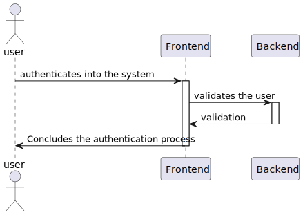
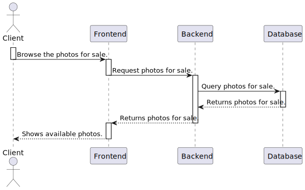
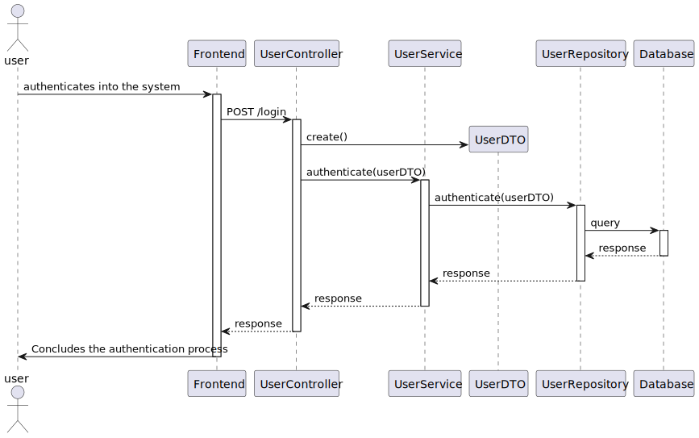
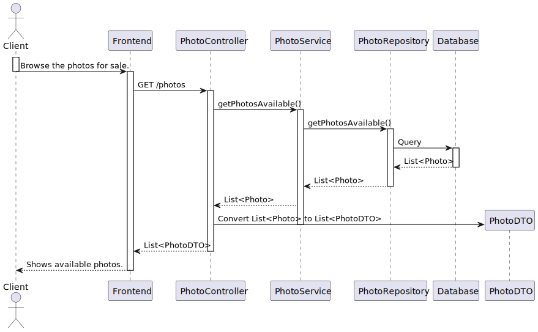

# High-Level System Architecture Diagram (4+1 Views Architecture)
## Logical View:  
Description:  
(TO DO)
## Process View:

In this analysis, we will examine various process views within the system, each representing distinct functionalities and user interactions. The process views to be analyzed are as follows:

| Process                      |
|------------------------------|
| **Create a Portfolio**      |
| **Put a Photo up for sale** |
| **Sign Up**                  |
| **Login**                    |
| **Browse Photos**            |
| **Add a photo to cart**      |
| **Checkout Cart**            |
| **View Purchased Photos**    |
| **Suspend a User**           |
| **Edit a User's Role**      |
| **Delete a photo**           |
| **Browse Users**             |

### Level 2:

#### Login

#### Browse Photos

#### Create a Portfolio

#### Add Photo to Cart

### Level 3:

#### Login
In this process view, the user is able to login to the system. The user is required to enter their username and password. The system will then verify the user's credentials and grant access to the system if the credentials are correct. If the credentials are incorrect, the system will display an error message and prompt the user to try again.
Also the user needs to have specific requirements in order to login, such as the user must be registered in the system and the user must have a valid username and password.

#### Browse Photos

#### Create a Portfolio

#### Add Photo to Cart

## Implementation View:

## Deployment View:

## Data Flow Diagram

In the Data flow Diagram we Divided the diagrams between the processes in order to clarify the flow of data of the processes in question.
### Login Register DFD

### Create Portfolio DFD

### Browse Photos DFD

### Add to Cart DFD

### Put a Photo up for sale DFD

