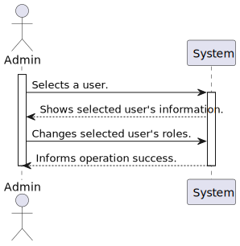
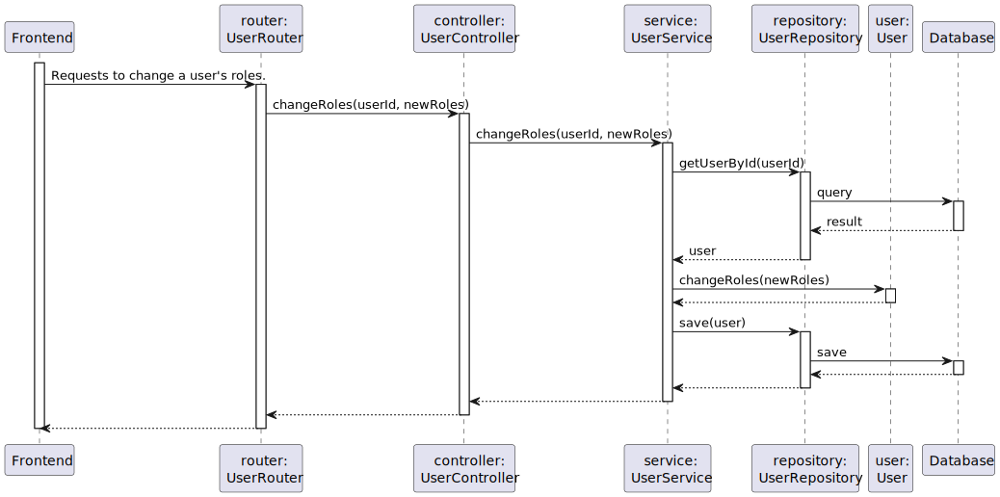

# High-Level System Architecture Diagram (4+1 Views Architecture)

## Domain Model

The concept of this project consists in a shop that has clients and has photographers, in which the photographers can have portfolios to sell their photos to the clients. The clients can buy photos from the portfolios and add them to their cart. The clients can also have a cart to add photos to it and then checkout the cart to buy the photos.

## Class Diagram

## Logical View:

Description:  

The logical view shows the app's architecture from above. It focuses on how the 
parts are organized and interact conceptually. The logical view highlights 
the system's structure, functions, and how different parts work together.

### Level 2:

## Process View:

In this analysis, we will examine various process views within the system, each representing distinct functionalities and user interactions. The process views to be analyzed are as follows:

| Process                      |
|------------------------------|
| **Create a Portfolio**       |
| **Put a Photo up for sale**  |
| **Sign Up**                  |
| **Login**                    |
| **Browse Photos**            |
| **Add a photo to cart**      |
| **Checkout Cart**            |
| **View Purchased Photos**    |
| **Suspend a User**           |
| **Edit a User's Role**       |
| **Delete a photo**           |
| **Browse Users**             |

### Use Case Diagram

The following Use Case Diagram shows the various use cases and which user roles are allowed perform them.

### Level 1:

#### Add Photo to Cart

#### Add Photo to Portfolio

#### BrowseUsers

#### Checkout Cart

#### Create Portfolio

#### Deactivate User

#### Delete Photo

#### Edit User Roles

#### View Purchased Photos

### Level 2:

#### Login

#### Browse Photos

#### Add Photo to Cart

#### Create Portfolio

#### Add Photo to Portfolio

#### Browse Users

#### Checkout Cart

#### Deactivate User

#### Delete Photo

#### Edit User Roles

#### View Purchased Photos

### Level 3:

#### Login
In this process view, the user is able to login to the system. The user is required to enter their username and password. The system will then verify the user's credentials and grant access to the system if the credentials are correct. If the credentials are incorrect, the system will display an error message and prompt the user to try again.
Also, the user needs to have specific requirements in order to login, such as the user must be registered in the system and the user must have a valid username and password.

#### Browse Photos

#### Add Photo to Cart

#### Add Photo to Portfolio

#### Browse Users

#### Checkout Cart

#### Create Portfolio

#### Deactivate User

#### Delete Photo

#### Edit User Roles

#### View Purchased Photos

## Implementation View:

## Deployment View:

This is the deployment view of the system when the commit is applied to the master branch, in which the Github actions will then build and Execute tests in order to check if the project is ready for production.

And then we have the deployment diagram, which shows the API communicating through HTTP/S.
In here, as TLS is compatible with HTTP/S, we will communicate through secure channels.

