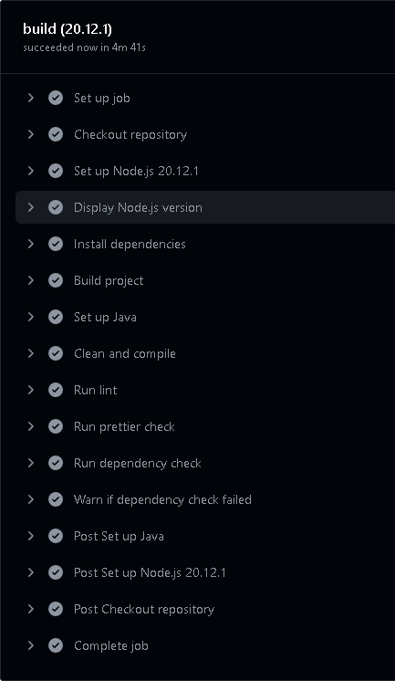

# Pipeline

The pipeline is composed by automated steps designed to ensure that complex processes are
broken in manageable stages, this aproach makes it easier to  enhance efficiency, consistency, and quality in the workflow and delivery of the project.
We are using the GitHub Actions for our Pipeline to build, run tests and ensure quality.

## Steps

We started by identifying the different steps that could be included in the pipeline.

- Build - build both the backend and the frontend to check if the new changes have introduced errors into the project.

- [Linter] - carry out a static analysis of the code to detect errors

- [Prettier] - to ensure that the code is formatted correctly and consistently

- Tests - automatically run the tests implemented in the project

## Workflow

In order to optimise waiting times, we divided the pipeline into three workflows: CI, on pull request and nightly build. This allows the more time-consuming steps to be executed less frequently than the less time-consuming ones.

### CI

This workflow of Continuous Integration (CI) is triggered whenever a push is made to the repository. The following steps are performed here: build, linter and prettier.  
  
Steps after a push is made.  

### On Pull Request

This workflow is triggered whenever a pull request is made. 
It is divided in  two jobs, one for the back-end and other for the front-end.
Making sure that the new code has the quality ensured, identify issues early as well as prevent the merge of faulty code
if any of the followings steps don´t check.

The following steps are performed here: build, linter, prettier, tests.

Steps running for a pull request back-end

### Nightly Build

This workflow has been scheduled to trigger every day at midnight with a job for back-end and other for front-end.
This build makes it easier for the developers to have up-to-date build of the project on the next day ready.

The schedule was created using the ‘schedule’ event with the following specification: cron: ‘0 0 * * *’.

Steps of Nightly Build for the front-end.

[Prettier]: https://prettier.io/
[Linter]: https://www.sonarsource.com/learn/linter/
